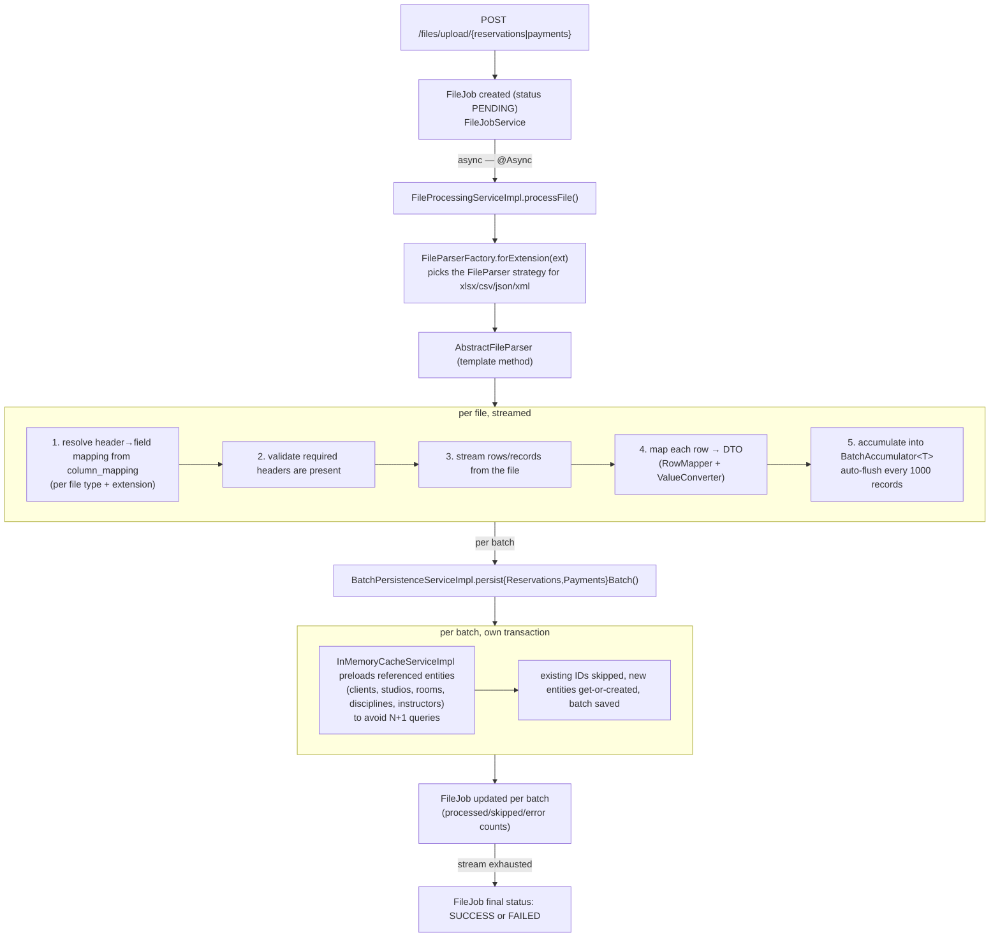

# Architecture

## Processing pipeline



Each batch is persisted in its own transaction — a failure partway through a large file doesn't roll back records already committed.

## Design patterns

**Strategy** — [`FileParser`](src/main/java/org/lsandoval/fileparser/service/parser/FileParser.java) defines `parse(File, ParseRequest, Class<T>, batchSize, Consumer<List<T>>)`. Four interchangeable implementations:
- [`ExcelFileParser`](src/main/java/org/lsandoval/fileparser/service/parser/ExcelFileParser.java) — Apache POI + `xlsx-streamer`, reads large workbooks without loading them fully into memory
- [`CsvFileParser`](src/main/java/org/lsandoval/fileparser/service/parser/CsvFileParser.java) — Apache Commons CSV
- [`JsonFileParser`](src/main/java/org/lsandoval/fileparser/service/parser/JsonFileParser.java) — Jackson streaming `JsonParser`, navigates to a configurable array path
- [`XmlFileParser`](src/main/java/org/lsandoval/fileparser/service/parser/XmlFileParser.java) — StAX `XMLStreamReader` with XXE protection, treats a configurable repeating element as one record

**Factory** — [`FileParserFactory`](src/main/java/org/lsandoval/fileparser/service/parser/FileParserFactory.java) maps a file extension to the right `FileParser` bean.

**Template Method** — [`AbstractFileParser`](src/main/java/org/lsandoval/fileparser/service/parser/AbstractFileParser.java) implements the shared skeleton (header validation, field mapping, batching via its inner `BatchAccumulator<T>`), leaving only format-specific row iteration to each subclass.

**Reflection-based row mapping** — [`RowMapper`](src/main/java/org/lsandoval/fileparser/service/parser/RowMapper.java) maps a `Map<String, Object>` row onto a DTO using cached setter `Method` lookups (`ConcurrentHashMap<Class<?>, Map<String, Method>>`), delegating type coercion to [`ValueConverter`](src/main/java/org/lsandoval/fileparser/service/parser/ValueConverter.java) (String/Number/Boolean/date/time parsing with multiple accepted formats).

**In-memory cache for N+1 avoidance** — [`EntityCacheService`](src/main/java/org/lsandoval/fileparser/cache/EntityCacheService.java) / `InMemoryCacheServiceImpl` preload every entity a batch will reference (by email, by name) in a handful of `findByXIn` queries before persisting, instead of hitting the DB per row.

**Configuration-driven extensibility** — two things that would otherwise be hardcoded per format are externalized:
- `file-parser.locators` in `application.yml`, bound by [`FileParserProperties`](src/main/java/org/lsandoval/fileparser/service/parser/FileParserProperties.java), tells each parser *where* records live (Excel sheet name / JSON array path / XML repeating element) per `(file type, extension)`.
- The `column_mapping` table tells each parser *which* source field maps to which DTO field, again per `(file type, extension)` — so a new client's export with different column headers is a data change via the `/column-mapping` endpoints, not a redeploy.

## Database schema

**Domain tables**: `client`, `studio`, `room` (FK → studio), `discipline`, `instructor`, `reservation` (FK → room/discipline/instructor/client), `payment_transaction` (FK → client).

**Processing metadata**: `file_processing_job` (status, counts, timestamps, error message), `column_mapping` (`UNIQUE(file_type, field_name, file_extension)` — one row per source field per format).

**Auth**: `users`, `roles`, `permissions`, `user_roles`, `role_permissions` — standard RBAC join tables.

## Auth model

JWT-based (JJWT 0.11.5, 24h expiry, secret from `JWT_SECRET`). `JwtAuthenticationFilter` validates the bearer token on each request; `SecurityConfiguration` wires the filter chain. Authorization is permission-based via `@PreAuthorize("hasAuthority('FILE_UPLOAD')")` on the file upload and column-mapping controllers — a `USER` role has `FILE_UPLOAD`, `ADMIN` has everything. Auth can be disabled entirely via `auth.jwt.enabled=false` (backed by `NoSecurityConfiguration`), useful for local testing.

## Package layout

```
org.lsandoval.fileparser/
├── auth/           JWT issuing/validation, users/roles/permissions, login endpoint
├── cache/          EntityCache preloading for batch persistence
├── dao/            JPA entities (dao.postgre.model) + Spring Data repositories
├── exception/       GlobalExceptionHandler, FileProcessingException
├── service/
│   ├── parser/     FileParser strategy + factory + template + row/value mapping
│   ├── impl/       FileProcessingServiceImpl, BatchPersistenceServiceImpl, etc.
│   └── model/      DTOs (ReservationDto, PaymentDto, job/*, mapping/*, parser/*)
└── web/            FileController, ColumnMappingController
```

